# Anki add-on for setting sort field for english decks
## Description
Add-on provides with info about english word family frequancies and calculated values of user knowing them that used for setting specified sort field.
23475 estimated as not congnate words provided.  
Made for use with [specific deck](https://ankiweb.net/shared/info/2060036838) still may be easily used with other ones by adding new method and selecting it in config
## Word sorting key
Add-on may be easily added with calculating priority methods wich may use family frequancy \[0, +inf\), probability of word being known, number of definitions provided by deck. Last one calculated automatically with another method that uses field content as argument and may be easily added and applied to use with add-on

default_priority = ffreq * (1 - known_probability) / number_of_definitions

For adding new number of definitions estimator add and decorate function in src/number_of_definitions_estimators.py and for adding priority estimator use src/learning_priority_estimators.py the same way
## Setting sort values
### Add-on installation
Use standart Anki add-on procedure or move content of src to any empty folder in dedicated directory
### Cautions
#### Saving copy of deck
For reason of any possible errors highly recommend to save copy of deck with progress made
#### Do not use other devices
For reason of unability to save changes from both devices while modifying structure of note on one of them consider do not use other devices for Anki before the end
### Creating sort field
Add-on created for setting dedicated only for sorting order field. Create dedicated field and set it as sort one if you haven't. Don`t forget to save changes

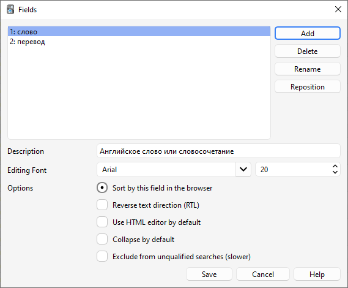  
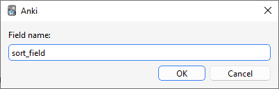  
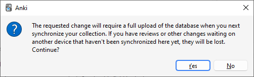  
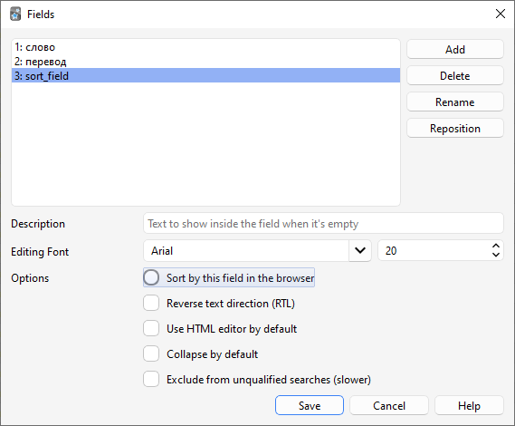  

### Editing settings
Anki provides easy way for configuring add-on settings Tools -> Add-ons (or Ctrl+Shift+A), select appropriate add-on and double click it.  
Don`t forget to OK after modifying settings

* **deck** – target deck for setting sort field
* **definitions_field** – field to be used for calculating amount of definitions
* **learning_priority_estimator** – function for calculating learning priority ("" for error with list of available options while sorting)
* **note_type** – note type of sorted cards
* **number_of_definitions_estimator** – function for calculating number of definitions ("" for error with list of available options while sortings)
* **number_of_known_words** – number of known words upon wich chances of word being known calculated. 0, 100, 200, 300... 16000 values are available, for other values closest value will be used.
* **sort_field** – field to modify with sort values
* **word_field** – filed of word for extracting correct probabilities. Supposed to be simplest for whole family
### Setting sort field
Tools -> set sort field  
It might be some time before script done, something around 6 mins.
### Sorting new cards by sort field
1. Select "Browse" in main menu (or B on keyboard)

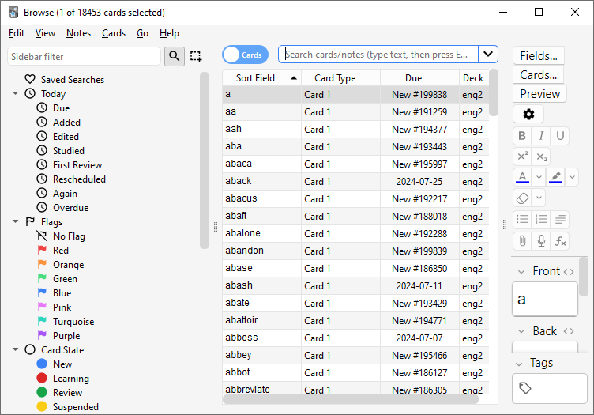

3. Select needed deck in sidebar

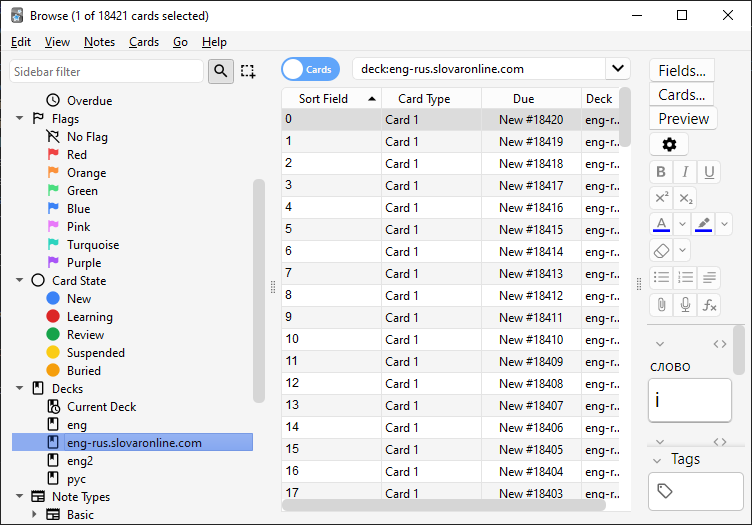

4. Apply new filter by adding `is:new` in the end of searchbar

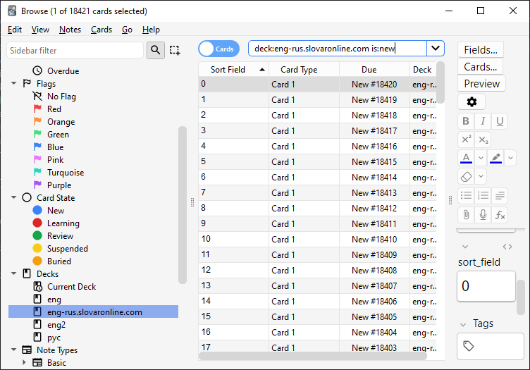

5. Sort cards (or nodes) by incresing sort field

Same as previous screen. Browser sorting display is shown by triangle pointed up net to "Sort field"

6. Selecting or cards (or nodes) by pressing Ctrl+A after interacting with table of search result.

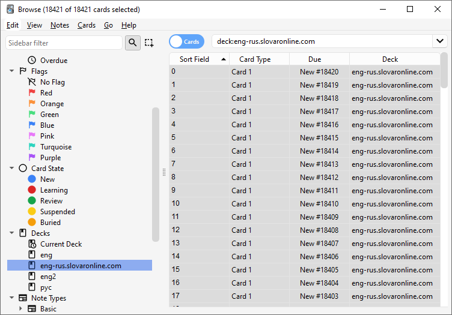

7. Reposition

Apply reposition by specified menu item or Ctrl+Shift+S shortcut. Use default reposition settings

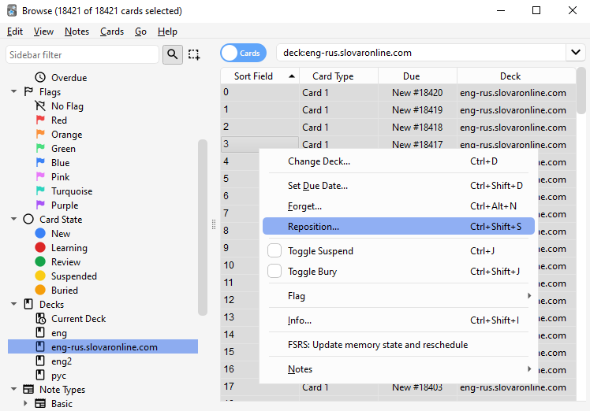  
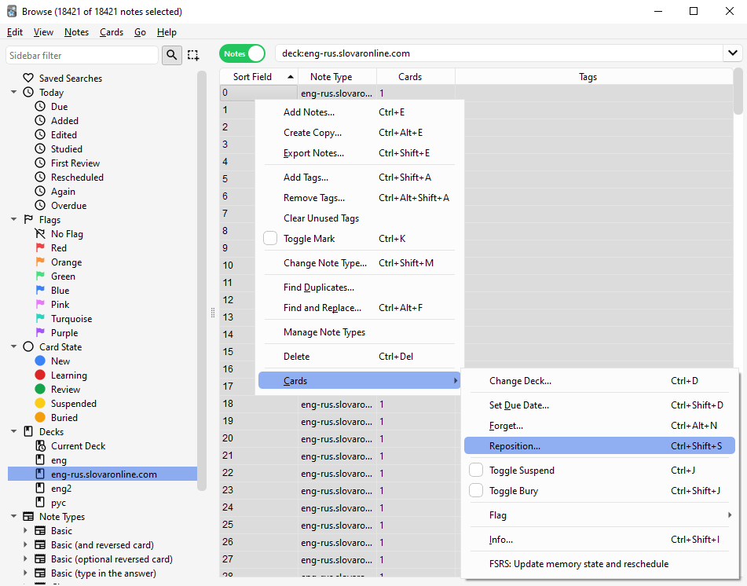  
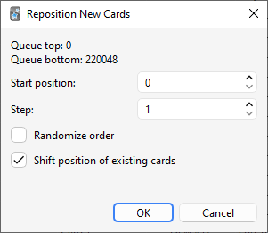

8. Check if it applied correctly

Applied correctly if sort field is growing with new number in cards display mode
### End
Work is done. Safely delete sort field with using same menu as sort field creation. Upload your changes to Anki web and other devices. You can safely delete add-on if needed and start using deck